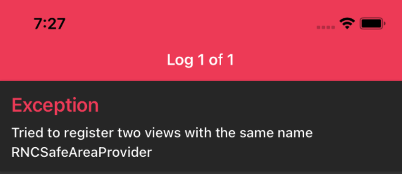

# A Basic TODO list in React Native

- This repo was built following the YouTube tutorial from [here](https://www.youtube.com/watch?v=0kL6nhutjQ8).
- Added authentication functionality from the same YouTube channel above from this [video](https://www.youtube.com/watch?v=ql4J6SpLXZA).

* If for some reason you got an error like:
  

  * Just need to do is go to `node_modules/invariant/browser.js` comment the if statement from line 28 to 46:
    ```javascript
    var invariant = function(condition, format, a, b, c, d, e, f) {
      if (process.env.NODE_ENV !== 'production') {
        if (format === undefined) {
          throw new Error('invariant requires an error message argument');
        }
      }

      // if (!condition) {
      //   var error;
      //   if (format === undefined) {
      //     error = new Error(
      //       'Minified exception occurred; use the non-minified dev environment ' +
      //       'for the full error message and additional helpful warnings.'
      //     );
      //   } else {
      //     var args = [a, b, c, d, e, f];
      //     var argIndex = 0;
      //     error = new Error(
      //       format.replace(/%s/g, function() { return args[argIndex++]; })
      //     );
      //     error.name = 'Invariant Violation';
      //   }
      //
      //   error.framesToPop = 1; // we don't care about invariant's own frame
      //   throw error;
      // }
    };

    module.exports = invariant;
    ```
  
  * Save the above, reload the app, undo the changes above and finally reload the app, at least that worked for me.
  * Original post from this stackoverflow [post](https://stackoverflow.com/questions/64931250/invariant-violation-tried-to-register-two-views-with-the-same-name-rncsafeareap)